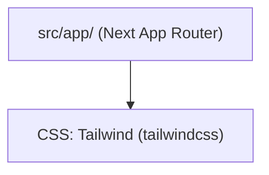

# Coppice

This is a short map of how this project is already built.
Keep this layout. Extend what exists. Do not start a second copy.

## How this project is built

- This repo uses the Next.js app folder. Keep it. Do not move to src/modules/.

## Libraries to keep using

Use the library already in the project. Do not add a second one for the same job.

- CSS: Tailwind (tailwindcss)

## Security

- next@15.4.8 is a known-vulnerable version (GHSA-267c-6grr-h53f, GHSA-26hh-7cqf-hhc6, GHSA-36qx-fr4f-26g5, GHSA-3g8h-86w9-wvmq, GHSA-3x4c-7xq6-9pq8, GHSA-4633-3j49-mh5q, GHSA-492v-c6pp-mqqv, GHSA-4c39-4ccg-62r3, GHSA-68g3-v927-f742, GHSA-89xv-2m56-2m9x, GHSA-8h8q-6873-q5fj, GHSA-955p-x3mx-jcvp, GHSA-9g9p-9gw9-jx7f, GHSA-c4j6-fc7j-m34r, GHSA-ffhc-5mcf-pf4q, GHSA-ggv3-7p47-pfv8, GHSA-gx5p-jg67-6x7h, GHSA-h25m-26qc-wcjf, GHSA-h64f-5h5j-jqjh, GHSA-m99w-x7hq-7vfj, GHSA-mg66-mrh9-m8jx, GHSA-mwv6-3258-q52c, GHSA-p9j2-gv94-2wf4, GHSA-q4gf-8mx6-v5v3, GHSA-vfv6-92ff-j949, GHSA-w37m-7fhw-fmv9, GHSA-wfc6-r584-vfw7). Stay on next; bump to 15.5.18. This is version-level — it does not mean every advisory is exploitable in this app. Do not add a second library.

## Unused extras

Do not delete Django apps, migrations, management commands, admin, models, or login pages.
These look unused. Only remove them if you are sure they are leftover experiments:

- Extra unused file: e2e/navigation.spec.js. Only remove it if you are sure nothing runs it.
- Extra unused file: playwright.config.js. Only remove it if you are sure nothing runs it.
- Unused export SITE_NAME in src/lib/site.js. Remove it.
- Unused export DASHBOARD_IMAGES in src/utils/dashboardScreenshots.js. Drop the export only; keep the value — it is used in this file.
- Package sharp@0.35.4 is not referenced in source, config, or CSS. Uninstall it.
